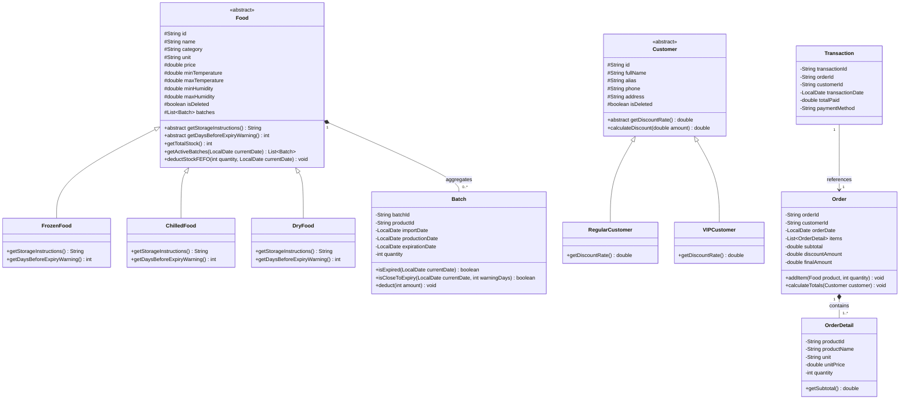

# Architecture & Domain Model Specification

This document outlines the architectural blueprint, domain models, object-oriented design decisions, and design principles applied in the **Food Store Management System**.

---

## 1. Architectural Paradigm: Layered MVC (3-Tier Architecture)

The system adheres to a **Layered Model-View-Controller (Layered MVC)** paradigm, structured into a clean **3-Tier Layered Architecture** with high cohesion and strict unidirectional dependencies:

```markdown
[ Presentation Layer / View (ui: AbstractMenu, Views, TableFormatter, ConsoleUtil) ]
                                      │
                                      ▼
[ Business Logic / Controller (service: ProductService, CustomerService, OrderService) ]
                                      │
                                      ▼
[ Data Access / Repository (repository: ProductRepository, CustomerRepository, MiniCsv) ]
                                      │
                                      ▼
[ Domain Model Layer (model: Food, Batch, Customer, Order, OrderDetail, Transaction) ]
```

### 1.1. Mapping Classic MVC to Project Packages

| MVC Component | Target Package | Realization & Architectural Responsibility |
| :--- | :--- | :--- |
| **View** | `fptu.pro192.foodstore.ui` | Formats and renders the 80-column ASCII terminal user interface, draws aligned tables, displays success/failure feedback, and captures raw keyboard input. Completely decoupled from business rules and file I/O. |
| **Controller** | `fptu.pro192.foodstore.service` | Coordinates user actions received from the View. Enforces business rules (BR1–BR27), executes algorithmic calculations (FEFO batch deduction, VIP discount computation), and manages state transitions. |
| **Model** | `fptu.pro192.foodstore.model`<br>& `fptu.pro192.foodstore.repository` | **Domain Entities (`model`)**: Encapsulates state and polymorphic behaviors (`Food` hierarchy, `Customers` hierarchy).<br>**Data Persistence (`repository`)**: Manages in-memory object collections and coordinates atomic CSV serialization via `MiniCsv`. |

### 1.2. Architectural Rationale: Preventing the "Fat Controller" Anti-Pattern

In standard academic MVC implementations, developers frequently collapse business rules, inventory algorithms, and physical file persistence directly into monolithic Controller classes. This leads to the **Fat Controller** anti-pattern, violating the **Single Responsibility Principle (SRP)** and making testing or modifications error-prone.

By adopting **Layered MVC**:

1. **Dedicated Service Layer (`service`)**: Contains all domain validation and business algorithms. Services are completely agnostic of whether output is rendered on a console, GUI, or web browser.
2. **Dedicated Repository Layer (`repository`)**: Encapsulates collection state and file persistence. Services never interact directly with file streams, file paths, or serialization parsing.
3. **Template-Driven Presentation (`ui`)**: Uses the Template Method pattern (`AbstractMenu`) to manage the terminal screen lifecycle without contaminating business services with console printing code.

### 1.3. Oral Defense / Presentation Summary

When explaining the system architecture during examination or project defense:
> *"Our project implements a **3-Tier Layered Architecture derived from the MVC pattern (Layered MVC)**. The **View** is encapsulated in `fptu.pro192.foodstore.ui` (handling 80-column console rendering). The **Controller** logic is separated into a dedicated **Service Layer** in `fptu.pro192.foodstore.service` (managing business rules and FEFO inventory deduction), while the **Model** is partitioned into domain entities (`model`) and data access repositories (`repository`). This separation strictly upholds the **Single Responsibility** and **Separation of Concerns** principles."*

---

## 2. Object-Oriented Domain Hierarchy



---

## 3. Subclasses for Product Classification

While a simple `CategoryType` enum could record the food category, our architecture **explicitly employs 3 distinct subclasses** (`FrozenFood`, `ChilledFood`, `DryFood`):

1. **Coursework & Academic Rubric (PRO192 Java OOP)**:
   * The grading criteria specifically evaluate deep object-oriented principles: **Inheritance**, **Polymorphism**, and **Method Overriding**.
   * Replacing product subclasses with an enum would eliminate one of the primary inheritance hierarchies in the project.
2. **Open-Closed Principle (OCP)**:
   * Polymorphic behavior: each subclass overrides `getStorageInstructions()` and `getDaysBeforeExpiryWarning()` (14 days for frozen, 1 day for chilled, 7 days for dry).
   * Adding a fourth category (e.g., `CannedFood` or `Beverage`) requires creating an additional subclass without modifying existing conditional logic.

---

## 4. Temperature & Humidity Bounds (HACCP Food Safety Standards)

All three product categories enforce standard safety thresholds:

| Category | Class | Temperature Range ($^\circ\text{C}$) | Humidity Range ($\%$) | Expiry Warning Threshold |
| --- | --- | --- | --- | --- |
| **Frozen Food** | `FrozenFood` | $-25.0 \le T \le -18.0$ | $85.0 \le H \le 95.0$ | 14 days |
| **Chilled Food** | `ChilledFood` | $0.0 \le T \le 4.0$ | $75.0 \le H \le 85.0$ | 1 day (BR20.1) |
| **Dry Food** | `DryFood` | $15.0 \le T \le 25.0$ | $30.0 \le H \le 60.0$ | 7 days (BR20.2) |

---

## 5. Terminal User Interface (TUI) Standards

* **Screen Width**: Fixed at **80 columns** (Standard VT100 / IBM 80-character line width).
* **Character Set**: Pure basic ASCII (`+`, `-`, `=`, `|`, `[ ]`, `*`) to guarantee cross-platform compatibility across Windows CMD (CP437, CP1252) and UTF-8 terminals.
* **Language Policy**:
  * **User Interface**: **Vietnamese** (Menus, table headers, error prompts, confirmations).
  * **Source Code & Documentation**: **English** (Class names, methods, comments, documentation).
* **Navigation Conventions**:
  * Option `0`: Always denotes Cancel / Return / Exit.
  * Screen transitions: Execute `ConsoleUtil.clearScreen()` upon navigation after confirmation.
  * Enter key: Always prompts user to press Enter to acknowledge and return.

### 5.1. Text Truncation & Monospace Fit Rule

To prevent lines from overflowing or distorting the 80-column ASCII borders, all displayed strings are formatted using a deterministic truncation helper `TableFormatter.fit(text, width)`:

* If `text.length() > width`, the string is cleanly cut to `width - 2` characters and appended with `..` (or clipped at exact boundary).
* The string is right-padded with whitespace to ensure exact width alignment.

### 5.2. Pre-Calculated 80-Column Table Layouts

#### 1. Product Table (80 columns total)

* Borders: 7 `|` borders + 12 padding spaces = 19 characters.
* Columns: ID (6) + Name (22) + Category (9) + Unit (6) + Price (11) + Stock (7) = 61 characters.
* **Total Width: $19 + 61 = 80$ characters.**

```text
+--------+------------------------+-----------+--------+-------------+---------+
| Mã SP  | Tên Sản Phẩm           | Phân Loại | ĐVT    | Đơn Giá     | Tồn Kho |
+--------+------------------------+-----------+--------+-------------+---------+
| P00001 | Mi Hao Hao Tom Chua Cay| DRY       | Goi    |   8,000 VND |     120 |
| P00002 | Sua Tuoi Tiet Trung 1L | CHILLED   | Hop    |  35,000 VND |      30 |
+--------+------------------------+-----------+--------+-------------+---------+
```

#### 2. Customer Table (80 columns total)

* Borders: 6 `|` borders + 10 padding spaces = 16 characters.
* Columns: ID (6) + Name (25) + Phone (12) + Address (15) + Tier (6) = 64 characters.
* **Total Width: $16 + 64 = 80$ characters.**

```text
+--------+---------------------------+--------------+-----------------+--------+
| Mã KH  | Họ Và Tên                 | Số ĐT        | Địa Chỉ         | Hạng   |
+--------+---------------------------+--------------+-----------------+--------+
| C00001 | Nguyen Van An             | 0901234567   | Ho Chi Minh     | VIP    |
| C00002 | Tran Thi Hoa              | 0987654321   | Binh Duong      | Regular|
+--------+---------------------------+--------------+-----------------+--------+
```

#### 3. Invoice Summary / Cart Table (80 columns total)

* Borders: 6 `|` borders + 10 padding spaces = 16 characters.
* Columns: No (3) + Product Name (28) + Qty (5) + Unit Price (14) + Subtotal (14) = 64 characters.
* **Total Width: $16 + 64 = 80$ characters.**

```text
+-----+------------------------------+-------+----------------+----------------+
| STT | Tên Sản Phẩm                 | SL    | Đơn Giá        | Thành Tiền     |
+-----+------------------------------+-------+----------------+----------------+
|   1 | Mi Hao Hao Tom Chua Cay      |     5 |      8,000 VND |     40,000 VND |
|   2 | Sua Tuoi Tiet Trung 1L       |     2 |     35,000 VND |     70,000 VND |
+-----+------------------------------+-------+----------------+----------------+
```
