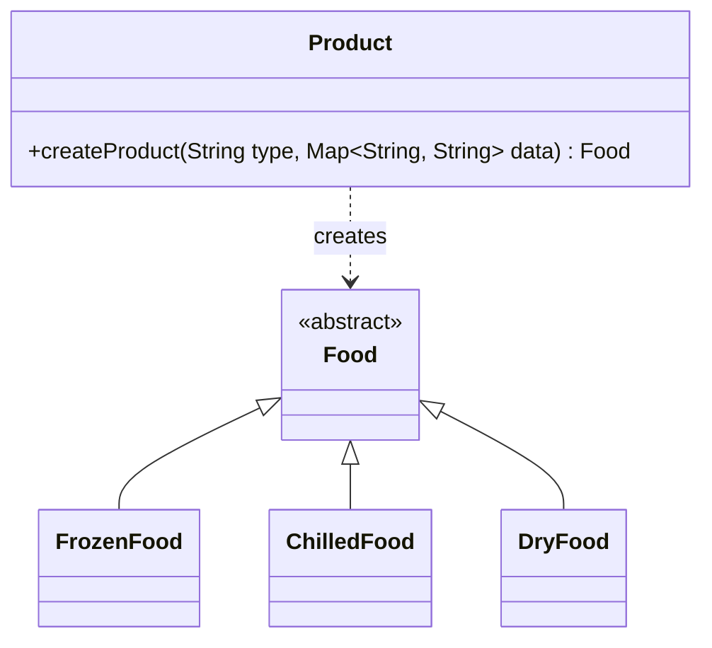
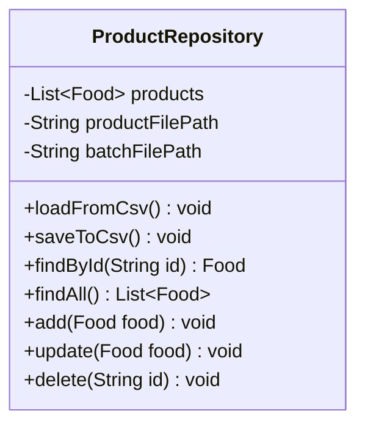
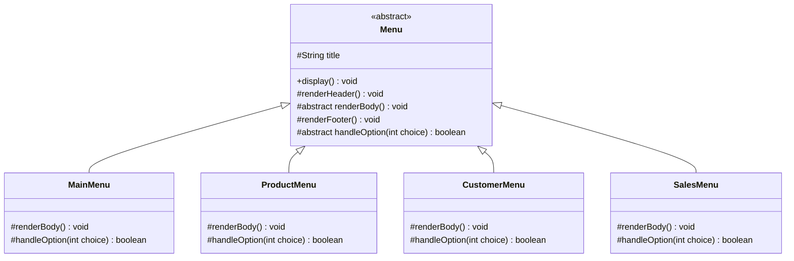

# Design Patterns Specification

This document details the software design patterns implemented in the **Food Store Management System**, providing architectural justifications and concrete Java 8 implementations for team members.

---

## 1. Factory Method Pattern

### Purpose & Problem Solved

When reading flat CSV records from disk, the application must instantiate the correct subclass (`FrozenFood`, `ChilledFood`, or `DryFood`; `RegularCustomer` or `VIPCustomer`) based on a type identifier string without coupling data access objects to concrete constructors.

### Class Diagram



### Java 8 Implementation Example

```java
public class Product {
    public static Food createProduct(
            String type,
            String id,
            String name,
            String category,
            String unit,
            double price,
            double minTemperature,
            double maxTemperature,
            double minHumidity,
            double maxHumidity,
            boolean isDeleted) {
        switch (type.trim().toUpperCase()) {
            case "FROZEN":
                return new FrozenFood(id, name, category, unit, price,
                        minTemperature, maxTemperature, minHumidity, maxHumidity, isDeleted);
            case "CHILLED":
                return new ChilledFood(id, name, category, unit, price,
                        minTemperature, maxTemperature, minHumidity, maxHumidity, isDeleted);
            case "DRY":
                return new DryFood(id, name, category, unit, price,
                        minTemperature, maxTemperature, minHumidity, maxHumidity, isDeleted);
            default:
                throw new IllegalArgumentException("Unknown product category type: " + type);
        }
    }
}
```

---

## 2. Lightweight Repository Pattern

### Purpose & Problem Solved

Decouples domain business services (`ProductService`, `CustomerService`, `OrderService`) from physical CSV file reading and writing without the excessive overhead of generic DAO interfaces and complex transaction management.

Each repository maintains an in-memory collection (`List<T>`) for high-speed CRUD queries and exposes straightforward `loadFromCsv()` and `saveToCsv()` methods. Persistence is handled atomically using a temporary file (`.tmp`) and `Files.move(..., ATOMIC_MOVE)` via `MiniCsv`.

### Class Diagram



### Implementation Example (`ProductRepository.java`)

```java
public class ProductRepository {
    private final String productFilePath;
    private final String batchFilePath;
    private final List<Food> products = new ArrayList<>();

    public ProductRepository(String productFilePath, String batchFilePath) {
        this.productFilePath = productFilePath;
        this.batchFilePath = batchFilePath;
        loadFromCsv();
    }

    public Food findById(String id) {
        for (Food food : products) {
            if (food.getId().equalsIgnoreCase(id) && !food.isDeleted()) {
                return food;
            }
        }
        return null;
    }

    public List<Food> findAll() {
        List<Food> active = new ArrayList<>();
        for (Food food : products) {
            if (!food.isDeleted()) {
                active.add(food);
            }
        }
        return Collections.unmodifiableList(active);
    }

    public void add(Food food) {
        products.add(food);
        saveToCsv();
    }

    // Atomic CSV persistence via MiniCsv and Java 8 NIO
    public synchronized void saveToCsv() {
        Path tempPath = Paths.get(productFilePath + ".tmp");
        Path targetPath = Paths.get(productFilePath);

        // 1. Serialize records to temp file via MiniCsv
        // 2. Atomically replace target file
        // Files.move(tempPath, targetPath, StandardCopyOption.REPLACE_EXISTING, StandardCopyOption.ATOMIC_MOVE);
    }
}
```

---

## 3. Singleton Pattern

### Purpose & Problem Solved

1. **`ScannerManager`**: Creating multiple `java.util.Scanner(System.in)` instances or closing one prematurely breaks the underlying standard input stream, throwing `NoSuchElementException`. A Singleton guarantees a single, application-wide managed scanner.
2. **`IdGenerator`**: Prevents sequence collisions and race conditions during ID generation across concurrent operations.

### Java 8 Implementation (`ScannerManager.java`)

```java
public class ScannerManager {
    private static ScannerManager instance;
    private final Scanner scanner;

    private ScannerManager() {
        this.scanner = new Scanner(System.in);
    }

    public static synchronized ScannerManager getInstance() {
        if (instance == null) {
            instance = new ScannerManager();
        }
        return instance;
    }

    public Scanner getScanner() {
        return scanner;
    }
}
```

---

## 4. Strategy Pattern (Polymorphic Discount Calculation)

### Purpose & Problem Solved

Different customer tiers (`RegularCustomer` vs `VIPCustomer`) require distinct pricing and discount calculation strategies. Rather than scattering conditional `if-else` blocks throughout `OrderService`, the discount calculation strategy is encapsulated directly within the polymorphic customer domain model.

### Implementation

```java
public abstract class Customer {
    protected String id;
    protected String fullName;
    protected String alias;
    protected String phone;
    protected String address;
    protected boolean isDeleted;

    public abstract double getDiscountRate();

    public double calculateDiscount(double subtotal) {
        return subtotal * getDiscountRate();
    }
}

public class RegularCustomer extends Customer {
    @Override
    public double getDiscountRate() {
        return 0.0; // BR15: Regular customers receive 0% discount
    }
}

public class VIPCustomer extends Customer {
    @Override
    public double getDiscountRate() {
        return 0.10; // BR16: VIP customers receive 10% discount
    }
}
```

---

## 5. Template Method Pattern (Console UI & Menu Lifecycle)

### Purpose & Problem Solved

The console user interface requires strict consistency across all feature menus:

* Uniform **80-column** standard width with fixed ASCII borders (`+`, `-`, `=`, `|`).
* Automatic screen clearing (`ConsoleUtil.clearScreen()`) before displaying a new screen.
* Standardized header with screen title and footer with navigation instructions (`[0] Quay lại / Hủy`).
* Uniform input validation and confirmation loops.
* Table Actions: Keys `[N]` (Next Page), `[P]` (Previous Page), `[S]` (Search sub-menu), `[O]` (Sort sub-menu), `[0]` (Back).
* Enter key: Always prompts user to press Enter to acknowledge and return.

Rather than duplicating this layout and lifecycle boilerplate across every menu class, the **Template Method Pattern** defines the invariant skeleton of a console screen in an abstract base class (`Menu` / `BaseView`), letting concrete subclasses implement only the specific body options and input handling logic.

### Class Diagram



### Implementation Example (`Menu.java`)

```java
public abstract class Menu {
    protected final String title;
    protected static final int MENU_WIDTH = 80;

    public Menu(String title) {
        this.title = title;
    }

    /**
     * The Template Method defining the execution lifecycle of a menu.
     */
    public void display() {
        boolean running = true;
        while (running) {
            ConsoleUtil.clearScreen();
            renderHeader();
            renderBody();
            renderFooter();
            int choice = ConsoleUtil.readInt("Chon chuc nang: ", 0, 9);
            if (choice == 0) {
                break; // Standard option 0: Cancel / Back / Exit
            }
            running = handleOption(choice);
            if (running) {
                ConsoleUtil.pressEnterToContinue();
            }
        }
    }

    protected void renderHeader() {
        System.out.println("=" + repeatChar('=', MENU_WIDTH - 2) + "=");
        System.out.println(TableFormatter.centerText(title.toUpperCase(), MENU_WIDTH));
        System.out.println("=" + repeatChar('=', MENU_WIDTH - 2) + "=");
    }

    protected abstract void renderBody();

    protected void renderFooter() {
        System.out.println("-" + repeatChar('-', MENU_WIDTH - 2) + "-");
        System.out.println("[0] Quay lai / Huy | Nhan phim so tuong ung de chon");
        System.out.println("-" + repeatChar('-', MENU_WIDTH - 2) + "-");
    }

    protected abstract boolean handleOption(int choice);

    private String repeatChar(char c, int count) {
        StringBuilder sb = new StringBuilder(count);
        for (int i = 0; i < count; i++) sb.append(c);
        return sb.toString();
    }
}
```
