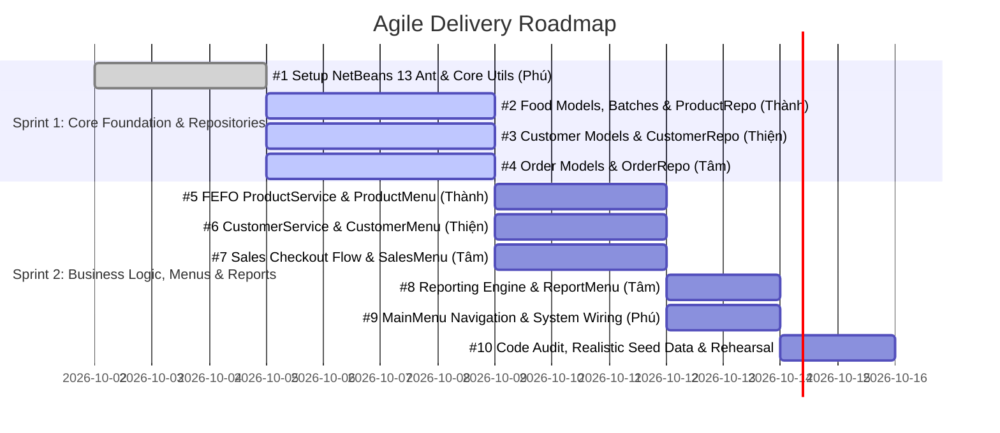

# Agile Tasks Registry

This document serves as the master registry and execution roadmap for the **Food Store Management System** development team.

---

## 📅 Sprint Schedule & Milestones

The project is structured into **two consecutive 1-week sprints (14 days total)** targeting Java 8 SE runtime and NetBeans 13 compatibility.

---

## 📋 Master Task Registry (Direct GitHub Issues Mapping)

| Issue # | File | Task Title | Assignee | Reviewer | Deadline | Status |
| :---: | --- | --- | :---: | :---: | :---: | :---: |
| **#1** | [`01_core_infrastructure.md`](01_core_infrastructure.md) | `feat(core): setup netbeans 13 ant project and core utilities` | Phú | Thành | Day 3 (04/10) | Ready |
| **#2** | [`02_food_models_and_repository.md`](02_food_models_and_repository.md) | `feat(product): implement food inheritance, batch model, and product repository` | Thành | Phú | Day 7 (08/10) | Ready |
| **#3** | [`03_customer_models_and_repository.md`](03_customer_models_and_repository.md) | `feat(customer): implement customer hierarchy, phone normalization, and repository` | Thiện | Phú | Day 7 (08/10) | Ready |
| **#4** | [`04_order_models_and_repository.md`](04_order_models_and_repository.md) | `feat(sales): implement order domain models and order repository` | Tâm | Phú | Day 7 (08/10) | Ready |
| **#5** | [`05_product_service_and_menu.md`](05_product_service_and_menu.md) | `feat(product): implement FEFO deduction in ProductService and 80-col ProductMenu` | Thành | Phú | Day 10 (11/10) | Ready |
| **#6** | [`06_customer_service_and_menu.md`](06_customer_service_and_menu.md) | `feat(customer): implement CustomerService and 80-col CustomerMenu` | Thiện | Phú | Day 10 (11/10) | Ready |
| **#7** | [`07_sales_checkout_and_menu.md`](07_sales_checkout_and_menu.md) | `feat(sales): implement sales checkout workflow and SalesMenu` | Tâm | Phú | Day 10 (11/10) | Ready |
| **#8** | [`08_reporting_service_and_menu.md`](08_reporting_service_and_menu.md) | `feat(report): implement monthly revenue and ranking reports with ReportMenu` | Tâm | Thành | Day 12 (13/10) | Ready |
| **#9** | [`09_main_menu_and_app_wiring.md`](09_main_menu_and_app_wiring.md) | `feat(core): implement MainMenu, wire application dependencies, and integration testing` | Phú | All | Day 13 (14/10) | Ready |
| **#10** | [`10_final_audit_and_seed_data.md`](10_final_audit_and_seed_data.md) | `chore(release): final clean code audit, seed realistic demo data, and presentation dry run` | All | Phú | Day 14 (15/10) | Ready |

---

## 🔄 Dependency Matrix

| Task | Depends On | Unblocks |
| --- | --- | --- |
| **#1 (Core Setup)** | — | **#2**, **#3**, **#4**, **#9** |
| **#2 (Food Models & Repo)** | **#1** | **#5**, **#7** |
| **#3 (Customer Models & Repo)** | **#1** | **#6**, **#7** |
| **#4 (Order Models & Repo)** | **#1** | **#7**, **#8** |
| **#5 (FEFO & ProductMenu)** | **#2** | **#7**, **#9** |
| **#6 (CustomerService & Menu)** | **#3** | **#7**, **#9** |
| **#7 (Sales Checkout Flow)** | **#4**, **#5**, **#6** | **#8**, **#9** |
| **#8 (Reporting Engine)** | **#4**, **#7** | **#9** |
| **#9 (MainMenu & Wiring)** | **#5**, **#6**, **#7**, **#8** | **#10** |
| **#10 (Audit & Seed Data)** | **#9** | Final Project Delivery |
